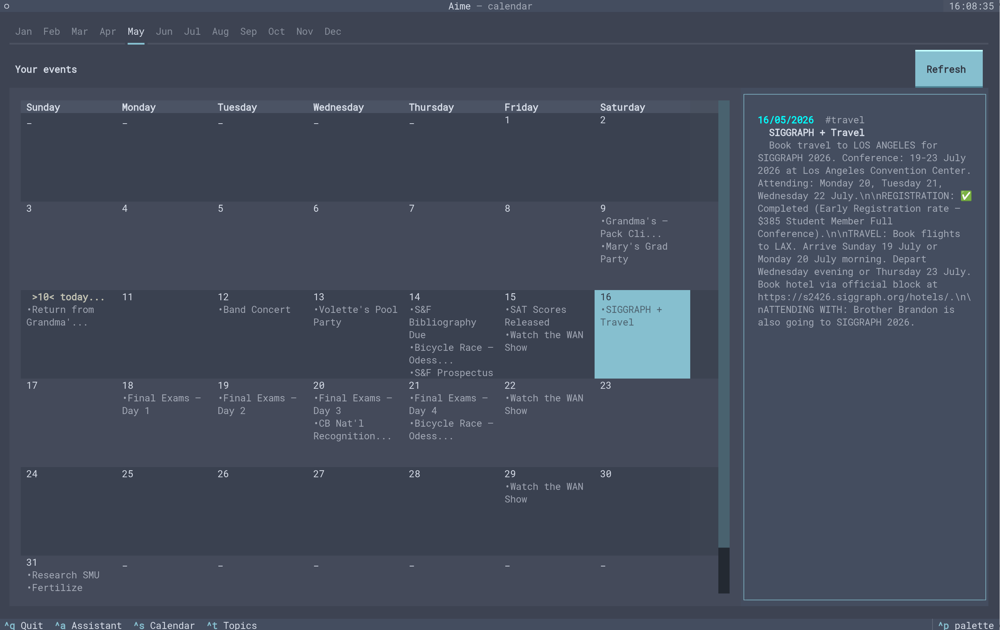
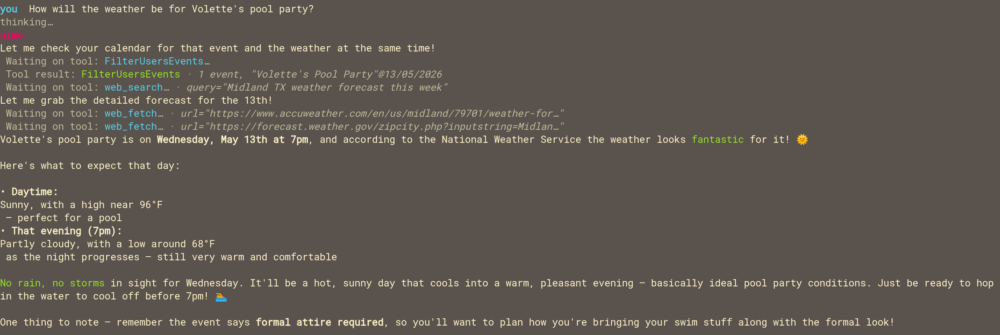
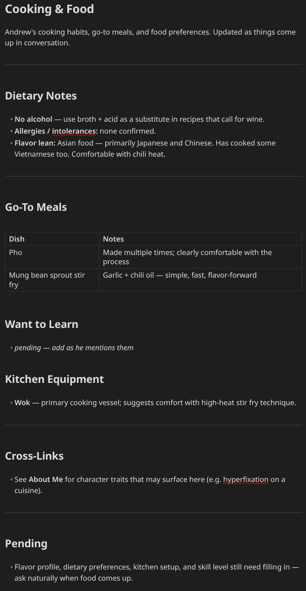

# Aime

<table align="center">
  <tr>
    <td valign="top" width="66%">
      
      <br />
      
    </td>
    <td valign="top" width="34%">
      
    </td>
  </tr>
</table>

# The Vision
Most AI assistants have amnesia — every conversation starts from zero, forcing you to re-explain your life, your context, and your goals over and over. Aime fixes that by acting as a persistent extension of your mind, remembering not just your schedule but your ideas, values, and evolving thoughts, so you can pick up exactly where you left off and keep building on what you know.

# The Goal
Aime aims to be a personal **assistant**. **Not a replacement** for **creativity** or **thinking**, but something that actively and thoughtfully **organizes your ideas and life**. It:

* Manages a simple **calender** interface based on what you prefer and say.

* Takes notes from conversations to **grow more personalized to you over time**

* Helps you **expand your thoughts**, organizing them into files and **researching/connecting whatever concepts** it needs to remove the friction between you and thought

---

# Installation

Aime officially supports MacOS and Linux, but the dependency list is small and cross platform so manually installing on Windows should be easy.

**Dependencies:**

* g++, c++17 or later

* sqlite3

* uv

* python3

* Anthropic API key - If you run scripts/textual_serve.sh, it will prompt you for it, otherwise it needs to be set as an environment variable using: ***Do not share the key with anyone!!***
  
  ```bash
  export ANTHROPIC_API_KEY=(your key) # Temporary variable. Search up how to set permanent variables.
  ```

**MacOS / Linux**

```bash
cd /path/to/aime/
./scripts/install.sh
```

Which creates the following folders:

```bash
/.config/aime-assistant/ #config files + agent session information
/.local/share/aime-assistant/ #User database
```

**Background service (recommended for most users):**

Aime has 2 parts, a **backend c++ server**, and the **frontend python TUI**. Both can be ran as a **background task** so that you never have to worry about them and can access Aime through your browser at <u>http://localhost:8000</u>.

```bash
cd /path/to/aime/
./scripts/backend_serve.sh #C++ backend. Required to run tui_model.py either way.
./scripts/textual_serve.sh #Allows you to access Aime through http://localhost:8000
                   #through web browser. Otherwise you would run tui_model.py directly
```

---
